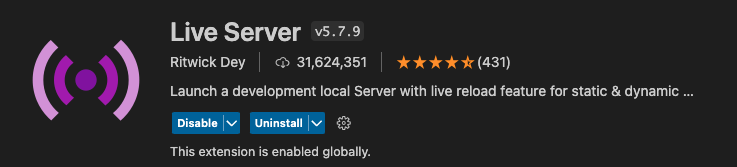
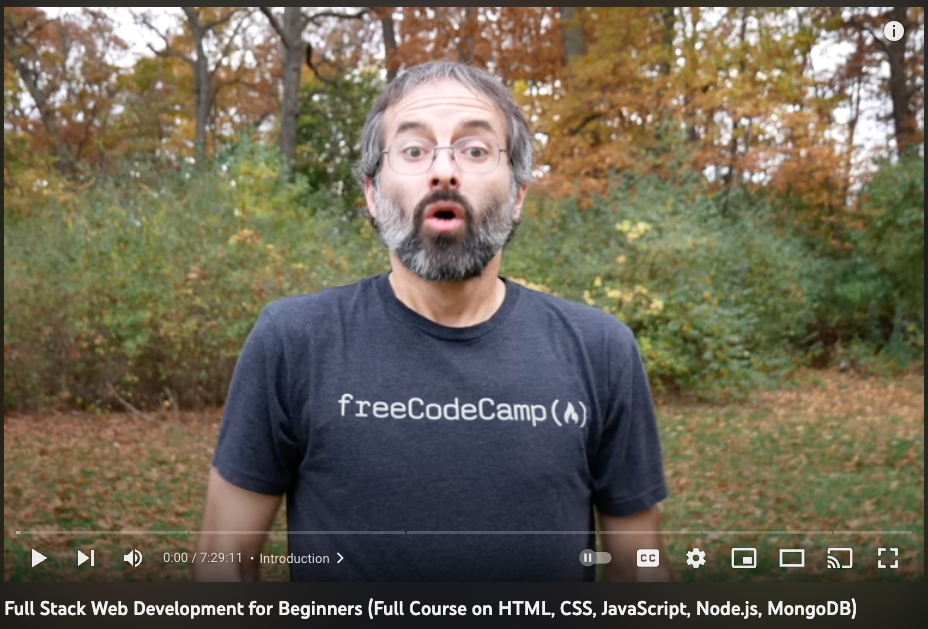

# Frontend Block 01
## Overview

**Welcome to CD Intro to HTML/CSS/JavaScript(vanilla)**, in this unit you will either be introduced or refreshed on the basics of using HTML , CSS, and JavaScript.

### Before you begin

To do our frontend development we will be using the IDE Visual Studio code. Please make sure that it is installed on your development device, before you continue.

Inside of visual studio code, we need to add the extention **Live Server**.

Here are step-by-step instructions to install the Live Server extension in Visual Studio Code:

1. Open Visual Studio Code on your computer. If you haven't installed it yet, you can download it for free from the Visual Studio Code website.
2. Click on the **Extensions** icon in the left-hand sidebar of Visual Studio Code. It looks like a square puzzle piece.
3. In the **Extensions Marketplace** search bar, type "Live Server" and hit enter.
4. You should see the "Live Server" extension in the search results. Click on the "Install" button located to the right of the extension's name.
5. Wait for the extension to download and install. This may take a few seconds to a few minutes depending on the size of the extension.
6. Once the extension is installed, you may need to reload Visual Studio Code for the changes to take effect. You can do this by clicking on the "Reload" button that appears next to the extension in the Extensions panel.
7. To confirm that the extension has been installed, you can check the list of installed extensions. Click on the "Extensions" icon again and look for "Live Server" under the "Installed" tab.

That's it! You have successfully installed the Live Server extension in Visual Studio Code. To use it, simply open an HTML file and click on the "Go Live" button at the bottom right corner of the editor window. The Live Server will launch a local web server and open your HTML file in a browser, allowing you to see your changes in real time.

## Part 01

In this current project which you should have at this time cloned locally on your device, there is a folder called **part01**, that containes the following files:

* index.html

You will be watching and following along with the video below from FreeCodeCamp:

[Full Stack Web Development for Beginners](https://www.youtube.com/watch?v=nu_pCVPKzTk&t=28s)

In the video the instructions guide to coding in the browser using Repl.it. At key points you will be asked to pause the video, and complete a coding challenge in this project folder before continuing.

>The reason for this, is so that when you complete a unit, you can push your changes up to github, and your Team Leads can track your progress.

After cloning this repo from GitHub Classroom, the first step for Part 01 is to create a new file inside its designated folder.To create the new file for Part 01A, follow these steps:

1. Locate the part01 folder in your file explorer or IDE, then right-click on it.

2. Select 'New file' or similar option to create a new file within the folder.

3. Name the file 'part01a.html', including the extension.

4. Open the 'part01a.html'

Congratulations on completing the HTML section of the video! It's time to showcase your skills and build a fantastic blog post. Don't worry; I've attached a screenshot of what it should look like. Now, let your creativity run wild, but make sure your blog post includes the following:

4 eye-catching pictures of your choice
4 prominent h1 headings to emphasize your key points
4 informative h2 headings to provide supporting details
4 well-written paragraph tags to convey your message effectively
4 links that direct to different sites to provide additional resources and insights
A footer to give your blog post a professional touch
One list of some sort to organize your content and make it easy to follow
With these elements in place, you'll have a blog post that's both informative and visually appealing. Get started on your masterpiece, and don't forget to have fun with it! 

## Part 02 - 

Well done on completing the CSS portion of the video! You're now ready for the next phase of the project, which is to create a fantastic Healthy Recipe blog. To help you get started, I've attached a screenshot of what your blog should look like in the imgs folder.

If you have any questions or need guidance, don't hesitate to reach out to your team lead. Remember, your blog must include a link that directs to the actual recipe page, ensuring that your readers can access and follow the recipe easily.

Creating a Healthy Recipe blog is an exciting and creative opportunity to showcase your skills and creativity. So, roll up your sleeves, put on your chef's hat, and get ready to cook up a storm! Good luck!

## Part 03 -

Congratulations on taking the first step towards becoming a better front-end developer by diving into the world of Javascript! With your newfound knowledge, you are now ready to take on your next challenge - building a tip calculator.

A tip calculator may seem like a simple task, but it is an essential tool for anyone who wants to provide great service and make their customers happy. As a front-end developer, you have the power to create a beautiful and functional tip calculator that will help people quickly and easily calculate their tip based on their meal cost and service quality.

This project will not only showcase your Javascript skills but also your creativity and attention to detail. You can add your own personal touch to the calculator by including custom graphics, animations, and user-friendly features. With your expertise, you can ensure that users have a positive experience while using the calculator and feel confident in their calculations.

By completing this task, you will not only enhance your development skills but also gain a sense of satisfaction from creating a useful tool that will benefit others. So go ahead and take on this challenge with enthusiasm, and let your skills shine!

